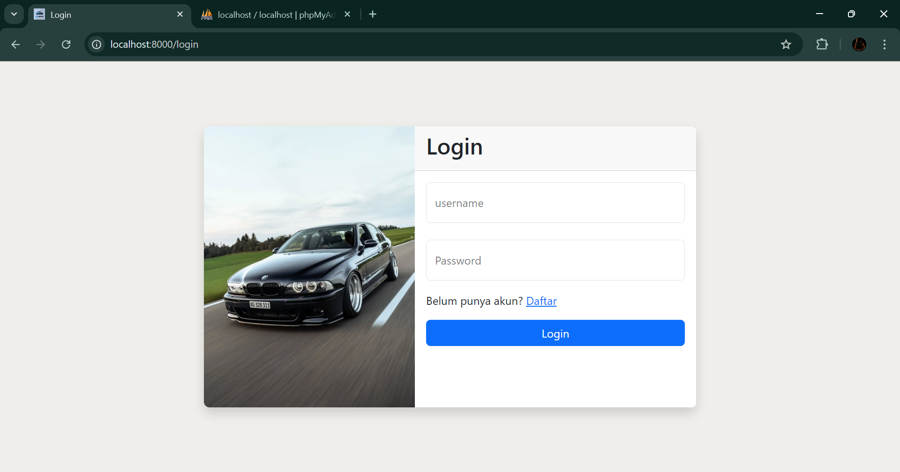
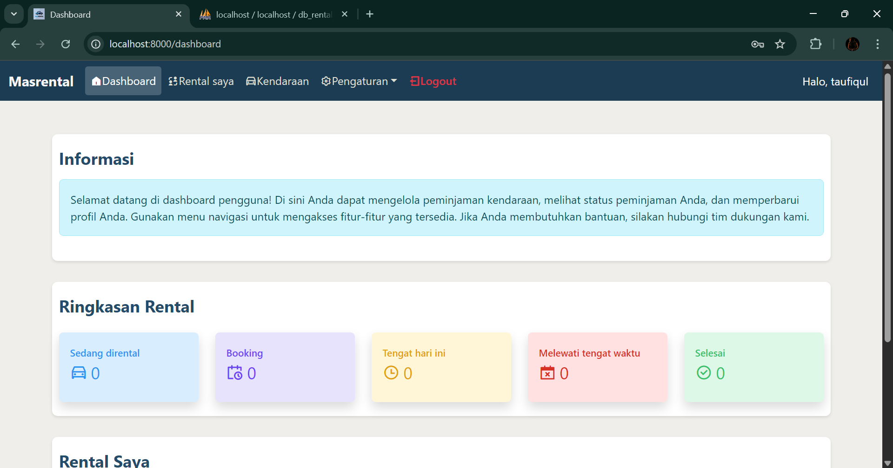
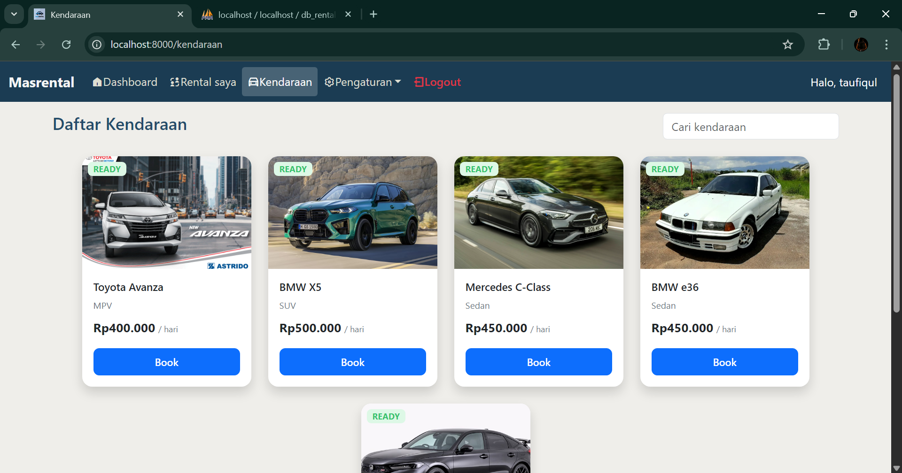

## 🚗 MasRental — Sistem Rental Kendaraan

MasRental adalah aplikasi berbasis web untuk mengelola penyewaan kendaraan.  
Dibuat sebagai tugas **PSAS** dengan menggunakan **Laravel 12**, **Bootstrap 5**, dan **MySQL**.

---

## 📌 Fitur Utama Sistem
- Login & Register
- Reset Password
- Pembagian akses **Admin dan User biasa**
- CRUD data kendaraan
- Sistem peminjaman kendaraan
- Riwayat peminjaman

---

## 👥 Pembagian Hak Akses
| Role | Akses |
|------|-------|
| **Admin** | Mengelola kendaraan, mengelola user, mengelola peminjaman |
| **User** | Melihat daftar kendaraan, meminjam kendaraan, melihat riwayat |

---

## 🔧 Teknologi yang Digunakan
| Teknologi | Versi |
|----------|-------|
| Laravel | 12 |
| PHP | 8.2 |
| Bootstrap | 5 |
| MySQL | 8 |
| ORM | Eloquent |

---

## 🗂 Struktur Database
| Tabel | Deskripsi |
|-------|-----------|
| `users` | Data user termasuk admin & user biasa |
| `kendaraan` | Data kendaraan yang dapat disewa |
| `pinjam` | Transaksi peminjaman kendaraan |

---
## Preview
| Login | Dashboard | kendaraan |
|-------|------|--------------|
|  |  |  |
---

